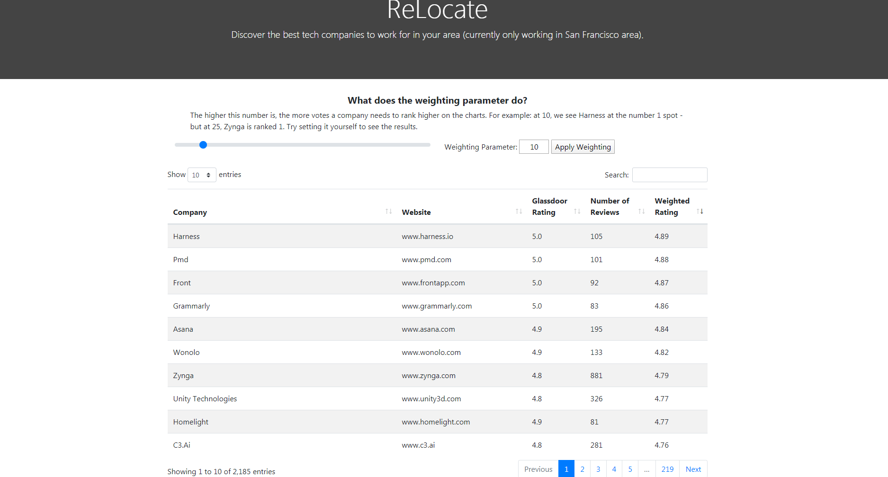

# Company-Tracker
# Demo
Feel free to try out the project yourself [here.](http://company-discover.herokuapp.com/)
# Screenshots

# Background
We want to look up technology companies based on their geographic location. So long as they hire software engineers in that location, we will add it to the list. For example, Microsoft is headquartered near Seattle, but also has positions available in San Francisco. Therefore, it will show up in a search for San Francisco.

There are a lot of companies which people may not know about. We want to be able to find these.

# Parsing HTML
In order to effectively crawl the internet, BeautifulSoup4 was used. The documentation is already quite robust, so we will not need to discuss it here. (https://www.crummy.com/software/BeautifulSoup/bs4/doc/)

# Cities Supported
Currently, only the following cities are supported:
* Ottawa, ON - Canada
* Toronto, ON - Canada
* Montréal, QC - Canada
* San Francisco, CA - United States

# Next Steps
Scan companies for their job postings
